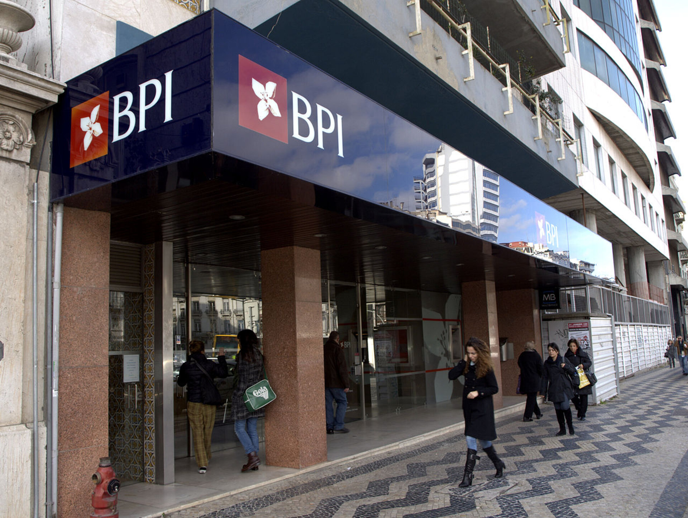
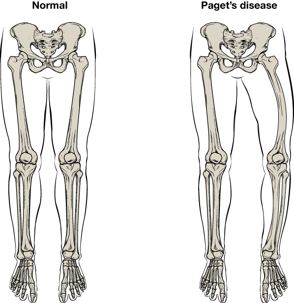

# Data Science Portfolio

Here are some of my best Data Science Projects. I have explored various machine-learning algorithms for different datasets. Feel free to contact me to learn more about my experience working with these projects.

***

[Predicting the trip duration of bikes rental in other to Improve the Intelligent Transport System](https://github.com/foday1989/foday1989.github.io/blob/master/Project/Linear%20Regression.ipynb)

- Used Linear Regression to predict the number of bikes rented in the city of Seoul
- The data had quite a few categorical variables which were encoded for use in the model
- Pandas, Numpy, Seaborn and Matplotlib where use to clean up and graph the data
- Encoded categorical variables to numeric using Sklearn due to the presence of many string columns
- Fit a multiple linear regression model with high prediction accuracy through iteration

***

[Determining whether a client will subscribe a term deposit or not using logistic classifier](https://github.com/foday1989/foday1989.github.io/blob/master/Project/Logistic%20Regression%20Project.ipynb)

- Used logistic regression to explore and make note of attributes information 
- Use data cleaning principles to get rid of the unwanted data
- Explore data with groupby function and analyzing it
- Used Logistic regression classifier to improve on the data to make better prediction on whether the client will subcribe or not
- Explored a machine learning approach to predict by using Sklearn numeric 

***

[Identifying symptoms of orthopedic patients as normal or abnormal]
(https://github.com/foday1989/foday1989.github.io/blob/master/Project/KNN%20AND%20NB%20Project.ipynb)

- Used the K Nearest Neighbours algorithm to classify a patient's condition as     normal or abnormal based on various orthopedic parameters
- Compared predictive performance by fitting a Naive Bayes model to the data
- Selected best model based on train and test performance

***

[Handwriting classification and recognition of numbers using Deep Neural Networks]
(https://github.com/foday1989/foday1989.github.io/blob/master/Project/Deep%20Neural%20Network%20Project.ipynb)

- Used Keras-Based to import the mnist data into your colab environment
- Explore the data descriptive and class distribution
- Use data preparation to normalize the pixel value of all images and the differences between pre-processed images and the normalized images 
- Evaluate the models by using Kfolds and validate its accuracy
- Summarize its diagnostics by using matplotlib to know the Cross Entropy Loss and Classification Accuracy

***

[Understanding the business problem in a data company and predicting the probability of a click being fraud]
(https://github.com/foday1989/foday1989.github.io/blob/master/Project/DT%20and%20Ensemble%20Project.ipynb)

- Use pandas, numpy, seaborn and matplotlib to clean up the data and to plot the graph
- Use the classification tool to summerize class distribution and transform the data using SMOTE so that oversample can be fit into counter.
- Import the train and test split from sklearn to help with the accurracy and the prediction
- Scaling of data to improve accurracy
- Use Ensemble models like Random forest, Adaboost ensemble, Bagging classifier and GgradientBoost classifier
- Campare the models and make a predictions 

